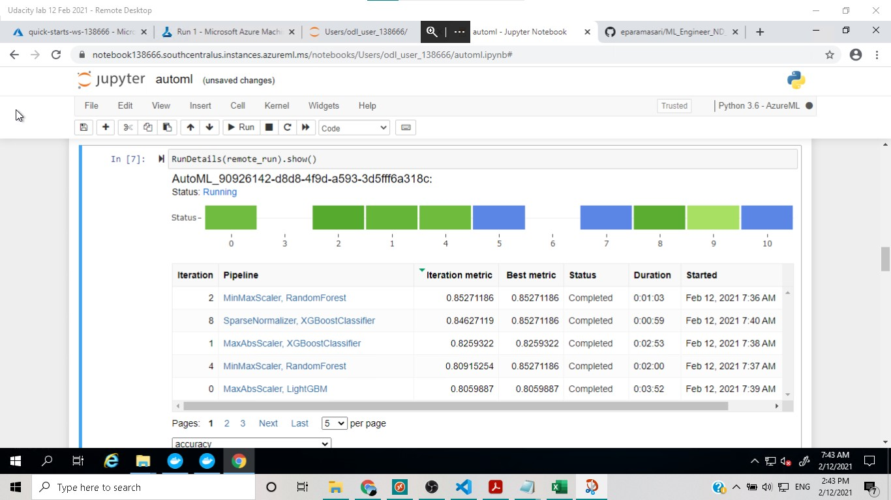
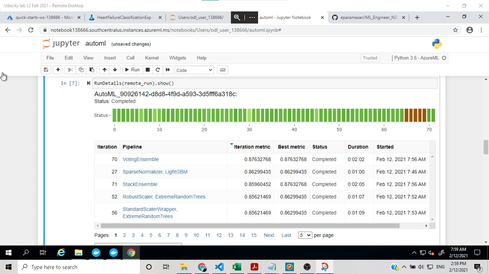
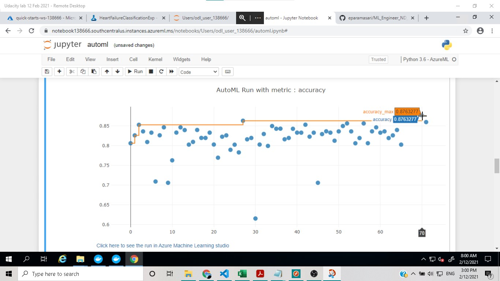
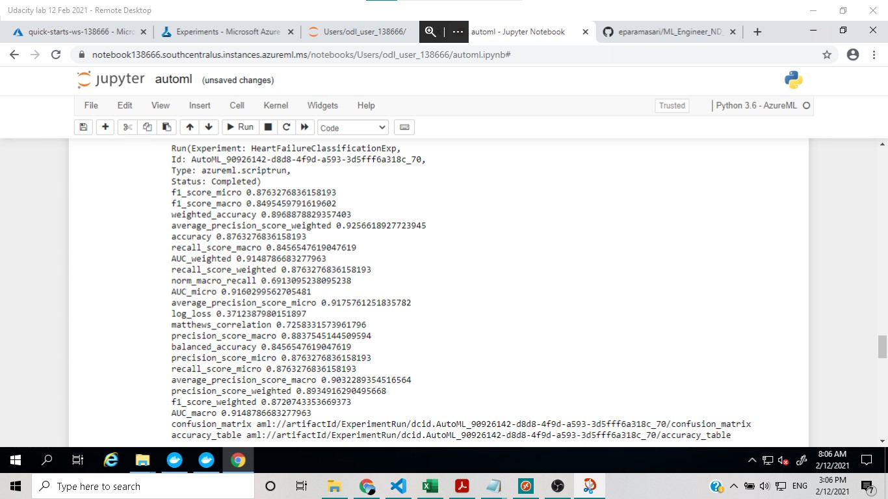
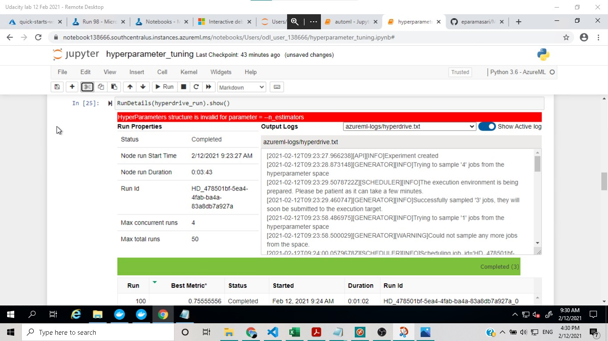
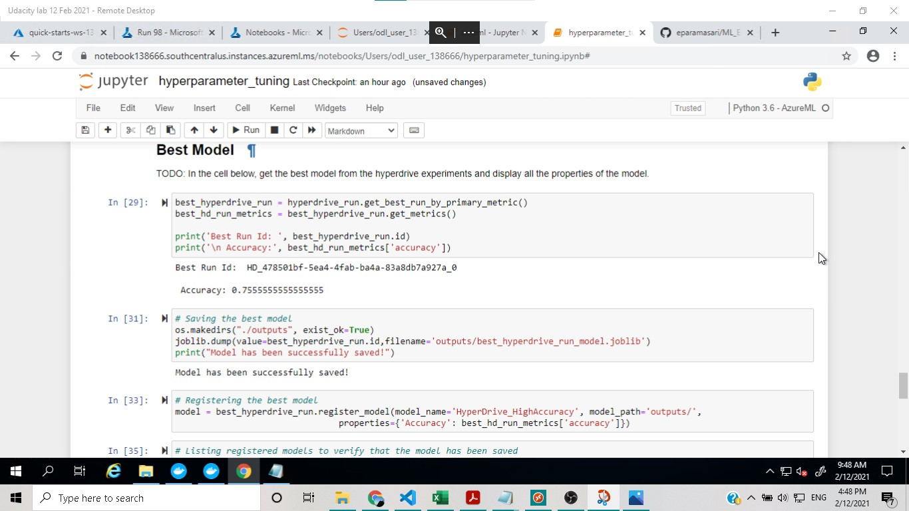

# Heart Failure Prediction: A Classification Model in Azure ML

This project is the Capstone Project for Udacity's Machine Learning Engineer for Microsoft Azure Nanodegree
In this project, a binary classification model was trained to predict the event of heart failure. Two methods of training were done, Azure Automated ML and Hyperdrive run.

## Project Set Up and Installation

This project uses:

- Jupyter Notebook 6
- Python 3.6
- Azure ML Studio
- Azure ML SDK

## Dataset

### Overview

This is a binary classification task that will predict death by heart failure. The dataset was initially acquired from Kaggle at [this link](https://www.kaggle.com/andrewmvd/heart-failure-clinical-data). The dataset has thirteen columns and can be used to predict whether the event of death occur or not.

### Task

A binary classification task was performed using twelve features to predict the occurrence of death.

These are the thirteen columns in the dataset, with twelve independent features and the last column as label:

- age (int): self explanatory
- anaemia (bool): whether there has been a decrease of red blood cells or hemoglobin
- creatinine_phosphokinase (int): level of the CPK enzyme in the blood in mcg/L
- diabetes (bool): whether the patient has diabetes
- ejection_fraction (int): percentage of blood leaving the heart at each contraction
- high_blood_pressure (bool): whether the patient has hypertension
- platelets (int): platelets in the blood in kiloplatelets/mL
- serum_creatinine (float): level of serum creatinine in the blood in mg/dL
- serum_sodium (int): level of serum sodium in the blood in mEq/L
- sex (int): female or male (binary)
- DEATH_EVENT (bool): whether the patient passed away

### Access

The data was available publicly in a github repo and accessed at [this link](https://raw.githubusercontent.com/eparamasari/ML_Engineer_ND_Capstone/main/data/heart_failure_clinical_records_dataset.csv) before being changed into a tabular dataset.

## Automated ML

The AutoML settings and configuration used for this experiment were as follows:

AutoML Settings:

- Experiment timeout: 20 minutes
- Maximum number of concurrent iterations: 5
- Primary evaluation metric: accuracy

AutoML configurations:

- type of task: classification
- Compute target: a newly created compute cluster saved in the variable compute_target
- Training data was saved in the variable ds for dataset
- Label column name: DEATH_EVENT
- Number of cross validations: 5

### AutoML Results

The best model was found to be **Voting Ensemble** with an accuracy of 0.89 and AUC Weighted of 0.91. Voting Ensemble is model which takes into account predictions from all the different models previously trained with the same data, thus makes it a very robust model in the end.

For further improvement, one can enable deep learning (for classification tasks such as this), change the number cross validations, and increase the training job time.

Here is a screenshot of the AutoML Run Details widget while it was running:

And here it is again when it was completed.

Here is another one showing the evaluation metric accuracy.

And the image below shows the best model retrieved from the AutoML Run.

## Hyperparameter Tuning with HyperDrive

The second run was a HyperDrive run, where hyperparameter tuning was automated with the HyperDrive package.

Random Forest, or random decision forests, was chosen in this run, since it is one of the best algorithm for a binary classification task. As an ensemble learning method, it is generally better than decision trees and some other classification algorithms. An early termination policy, Bandit Policy, was used since it allows termination of runs which do not reach the specified slack factor within the specified time thus it is time saving.

The hyperparameters used in this run includes the number of estimators and the minimum number of samples required to split an internal node.

### HyperDrive Run Results

The best run, with an accuracy of 0.755, was achieved with 20 estimators and 4 as minimum number of samples required to split an internal node.

To improve the results of similar experiments, one can try to use other types of classification models, such as logistic regression or gradient boosted trees, in the HyperDrive Run, to see if it would result in better accuracy. One can also change the hyperparameters used.

Here is a screenshot of the HyperDrive Run Details widget

And here is another one showing the best model retrieved from the HyperDrive Run.

## Model Deployment

Since the best model from the AutoML run, Voting Ensemble, has a better accuracy than that from the HyperDrive Run, it was then deployed with Azure Container Instances (ACI).

Some requests were then sent to the http endpoint using both the notebook and the command line / shell Git Bash. The `<endpoint.py>` script in this repository was used to perform the http request from the command line. Both methods showed consistent and good accuracy of the predictions.

## Screen Recording

Below is a link to the screen recording of the deployed model in action.

[Azure Machine Learning - AutoML and HyperDrive](https://youtu.be/zyEC8dc6ZGQ)

## References

- Microsoft docs and learn pages
- Stack Overflow
- Scikit-learn documentation