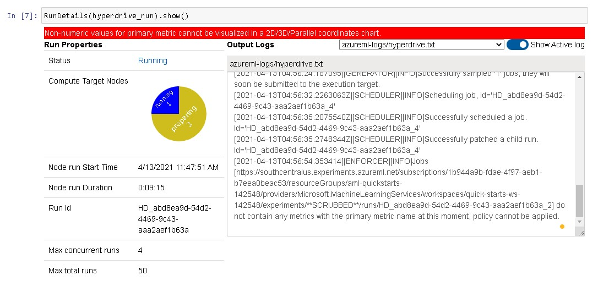
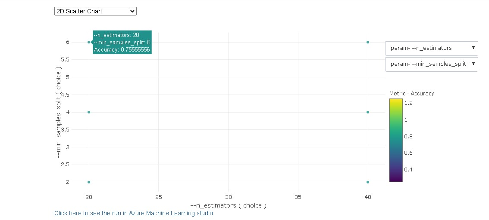
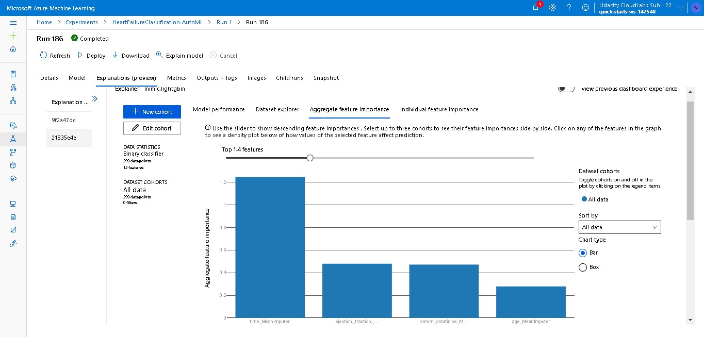

# Heart Failure Prediction: A Classification Model in Azure ML

This project is the Capstone Project for Udacity's Machine Learning Engineer for Microsoft Azure Nanodegree
In this project, a binary classification model was trained to predict the event of heart failure. Two methods of training were done, Azure Automated ML and Hyperdrive run. From the two methode, two models were produced and both were registered.

After comparing the two models based on the metric of accuracy, it was found that the one from Automated ML was better. The Automated ML model, Voting Ensemble, was then deployed using Azure Container Instances (ACI) and consumed using HTTP requests to its REST endpoint.

Here is a diagram of the project flow:


## Project Set Up and Installation

This project uses:

- Jupyter Notebook 6
- Python 3.6
- Azure ML Studio
- Azure ML SDK

## Dataset

### Overview

This is a binary classification task that will predict death by heart failure. The dataset was initially acquired from Kaggle at [this link](https://www.kaggle.com/andrewmvd/heart-failure-clinical-data). The dataset has thirteen columns and can be used to predict whether the event of death occur or not.

### Task

A binary classification task was performed using twelve features to predict the occurrence of death.

These are the thirteen columns in the dataset, with twelve independent features and the last column as label:

- age (int): self explanatory
- anaemia (bool): whether there has been a decrease of red blood cells or hemoglobin
- creatinine_phosphokinase (int): level of the CPK enzyme in the blood in mcg/L
- diabetes (bool): whether the patient has diabetes
- ejection_fraction (int): percentage of blood leaving the heart at each contraction
- high_blood_pressure (bool): whether the patient has hypertension
- platelets (int): platelets in the blood in kiloplatelets/mL
- serum_creatinine (float): level of serum creatinine in the blood in mg/dL
- serum_sodium (int): level of serum sodium in the blood in mEq/L
- sex (int): female or male (binary)
- DEATH_EVENT (bool): whether the patient passed away

### Access

The data was available publicly in a github repo and accessed [here](https://raw.githubusercontent.com/eparamasari/ML_Engineer_ND_Capstone/main/data/heart_failure_clinical_records_dataset.csv) before being changed into a tabular dataset.

## Automated ML

The AutoML settings and configuration used for this experiment were as follows:

AutoML Settings:

- Experiment timeout: 45 minutes
- Maximum number of concurrent iterations: 5
- Primary evaluation metric: accuracy

AutoML configurations:

- type of task: classification
- Compute target: a newly created compute cluster saved in the variable compute_target
- Training data was saved in the variable ds for dataset
- Label column name: DEATH_EVENT
- Number of cross validations: 5

### AutoML Results

The best model was found to be **Voting Ensemble** with an accuracy of 0.88 and AUC Weighted of 0.91. Voting Ensemble takes into account predictions from all the different models previously trained with the same data, thus makes it a very robust model in the end.

Here are the parameters generated by the AutoML best model:

```
min_samples_leaf=0.035789473684210524,
min_samples_split=0.01,
min_weight_fraction_leaf=0.0,
n_estimators=100,
n_jobs=1,
oob_score=False,
random_state=None,
verbose=0,
warm_start=False
```

Here is a screenshot of the AutoML Run Details widget while it was running.


And here are some of the screenshots again when the automl run was completed. The one below shows the list of models trained.


Here is one showing the different evaluation metric accuracy of the models.


And the image below shows the best model retrieved from the AutoML Run.


Here some other screenshots showing the details and metrics of the best models.


For further improvement, one can enable deep learning (for classification tasks such as this), change the number cross validations, and increase the training job time.

## Hyperparameter Tuning with HyperDrive

The second run was a HyperDrive run, where hyperparameter tuning was automated with the HyperDrive package.

Random Forest, or random decision forest, was chosen in this run, since it is one of the best algorithm for a binary classification task. As an ensemble learning method consisting of many decision trees, it is generally better than decision trees and some other classification algorithms.

An early termination policy, Bandit Policy, was used since it allows termination of runs which do not reach the specified slack factor within the specified time thus it is time saving.

The hyperparameters used in this run includes the number of estimators, which specifies the number of trees in the forest, and the minimum number of samples required to split an internal node, and the search space for those hyperparameters were set to a choice of 20, 40, and 20, 40, 60, respectively. Microsoft Azure's HyperDrive RandomParameterSampling class would randomly select the hyperparameters from the provided search space.

### HyperDrive Run Results

The best run, with an accuracy of 0.75, was achieved with 20 trees/estimators and 2 as the minimum number of samples required to split an internal node.

To improve the results of similar experiments, one can try to use other types of classification models, such as logistic regression or gradient boosted trees, in the HyperDrive Run, to see if it would result in better accuracy. One can also change the hyperparameters used.

Here is a screenshot of the HyperDrive Run Details widget while it was running.



And here are some of the screenshots again when the hyperdrive run was completed. The one below shows the list of models trained.


Here is one showing the evaluation metric accuracy of the models.




And here is another one showing the best model retrieved from the HyperDrive Run, its parameters and metrics.


## Model Deployment

Since the best model from the AutoML run, Voting Ensemble, has a better accuracy than that from the HyperDrive Run, it was then deployed with Azure Container Instances (ACI).

Other options for deployment includes Local web service, Azure Kubernetes Service (AKS), and Azure Machine Learning compute clusters. For testing and development purposes, deployment using ACI is the best option, since it only needs low-scale CPU-based workloads.

The model deployment only required a few lines of codes. First we import the service we would like to use to deploy the model, configure the deployment, then the next line is the deployment code, and the last line shows the output of the deployment.

```
from azureml.core.webservice import AciWebservice

deployment_config = AciWebservice.deploy_configuration(cpu_cores = 1, memory_gb = 1)
service = Model.deploy(ws, "myservice", [best_automl_model], inference_config, deployment_config)
service.wait_for_deployment(show_output = True)
```

After deployment, we can see both in Azure ML Studio and the notebook that the service is in a healthy state.

Here are screenshots of the endpoint in a healthy state in Azure ML Studio.


And here is a screenshot of the same in the notebook.


Some http requests were then sent to the REST endpoint using both codes from the notebook and the command line / shell Git Bash. The `<endpoint.py>` Python script in this repository was preparead and used to perform the http request from the command line. The `<endpoint-score.py>` Python script, on the other hand, was copied from the Azure ML Studio, and we only needed to change the input data before it was also used for testing. Both methods showed consistent and good accuracy of the predictions.

Here is the code used to send the http request from the notebook.

```
import requests # for http post request

# Set the content type
headers = {'Content-type': 'application/json'}

response = requests.post(service.scoring_uri, test_sample, headers=headers)
```

Please note that the `<test_sample>` was a subset of the original data that we had already sampled with the purpose of testing the REST endpoint. We then compared the inference with the ground truth labels, and they show the same results.

An interesting additional feature of the Azure ML Studio is that we can see feature importance in the Explanations tab of the model. Here are some screenshots showing the aggregate feature importance and model dependence on the `time` feature in the Azure ML Studio.




## Screen Recording

Below is a link to the screen recording of the deployed model in action.

[Azure Machine Learning - AutoML and HyperDrive](https://youtu.be/Ep3lc_Y5KnU)

## References

- Microsoft [docs](https://docs.microsoft.com/en-us/azure/) and [learn](https://docs.microsoft.com/en-us/search/?terms=azure%20machine%20learning&category=Learn) pages
- [Stack Overflow](https://stackoverflow.com/)
- [Scikit-learn documentation](https://scikit-learn.org/stable/modules/generated/sklearn.ensemble.RandomForestClassifier.html)
